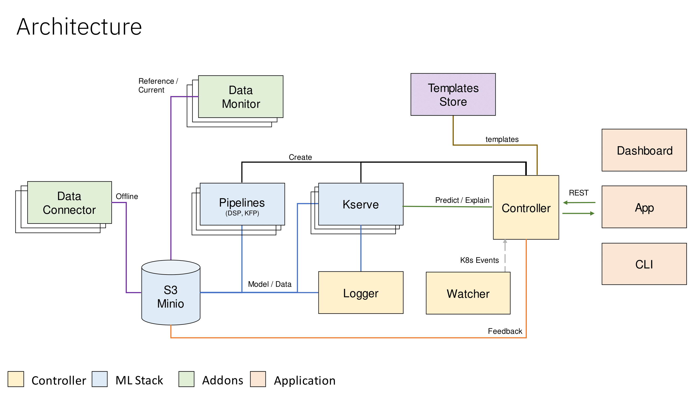
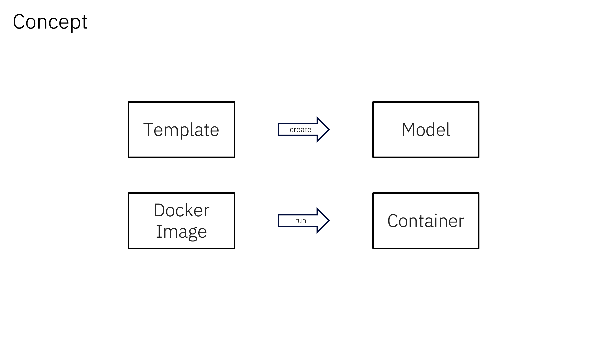
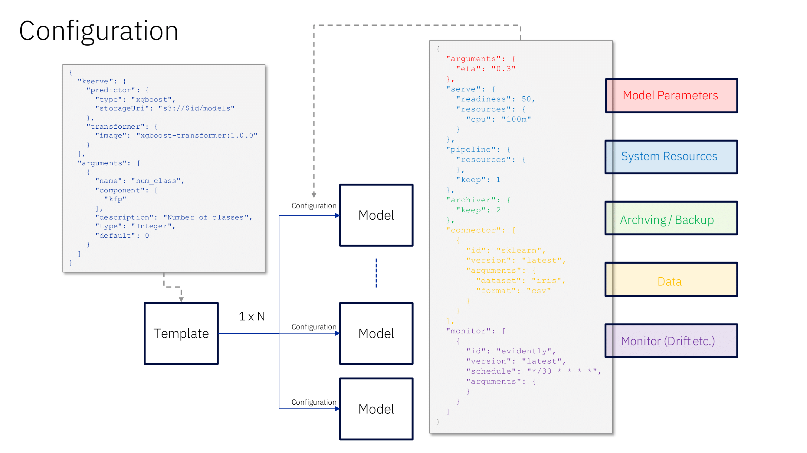

# KModels

**⚠️ WORK IN PROGRESS ⚠️**

We are currently releasing the *Controller* of KModels as well as some sample *Templates*, mainly as a reference for review purposes. Additional components and the entire installation of KModels will soon follow.


## Overview

KModels is an AI model lifecycle management and deployment framework developed to simplify the complexities of deploying, maintaining, and using AI models by utilizing the concept of model templates. These templates are shareable packages that encapsulate the blueprints: code and metadata for creating new models tailored to specific business use cases. With KModels, you have full control over the model lifecycle, enabling you to manage versions and monitor the performance of deployed models.

KModels aims to reduce the technical skills required for AI integration in business applications without sacrificing quality or comprehensiveness. It can be deployed on Kubernetes clusters, running locally or on the cloud, and integrates two main open-source projects: Kubeflow Pipelines and KServe.

## Key Features

- Deploy ready models from the templates store.
- Instantiate multiple models from a single template.
- Full lifecycle control of AI models.
- On-premise data training.
- Integration with [Kubeflow Pipelines](https://github.com/kubeflow/pipelines) and [KServe](https://github.com/kserve/kserve).
- Template versioning and extendability.
- Comprehensive model monitoring and archiving.

## Architecture  

  

## Model Template

The model template serve as portable package that bundle together the frameworks and specifications needed to create customized models tailored to specific business needs. They include both the underlying code and metadata, providing a comprehensive blueprint for generating new models. 

To further illustrate, consider the relationship between a Docker image and a Docker container. A Docker image contains all the instructions, dependencies, and configuration required to create a Docker container. When you launch a container, it is based on this image, inheriting all the specified properties and setup.

Similarly, these model templates function like Docker images. They contain all the essential components – such as algorithms, preprocessing steps, and necessary configurations – required to build a model. When you create a new model using one of these templates, it's akin to launching a Docker container from an image. The new model inherits all the predefined configurations and structures from the template, ensuring consistency and efficiency in deploying models for various business applications. This analogy helps to understand how the abstract concept of model templates translates into practical, deployable models in a business context.

    
  
The image below further illustrates the concept of a model template:   




The template’s metadata (left) defines the information needed for instantiating a model and the supported arguments for configuration. Upon instantiation, a configuration file fills in all the necessary data and a model instance is created.  

For more information on model template creation and structure see [Templates](templates/README.md).
 

## Repository Structure

```
.
├── controller
│   ├── api
│   ├── logs
│   └── src
│       ├── controllers
│       ├── models
│       ├── services
│       └── utils
├── resources
├── store
│   ├── app
│   └── docs
└── templates

```


### Controller

The Controller is the main component responsible for handling the lifecycle of AI models within KModels. It offers a comprehensive set of APIs to manage model creation, deployment, monitoring, retraining, and feedback collection. The Controller ensures smooth synchronization of models and integrates seamlessly with Kubeflow Pipelines and KServe.

#### Key Features

- Instantiate models from templates.
- Full lifecycle management: creation, deployment, monitoring, retraining, and deletion.
- Synchronize model states and metadata.
- Collect and manage model feedback.
- Handle inference requests for prediction and explanation.

For more information on the controller component refer to [Controller](controller/README.md).

### KStore

KStore is a KModels application for storing and reteriving tempaltes. The KStore expose REST API which can be used to add, remove and download templates.

For more information on the Kstore component refer to [Kstore](store/README.md).

### Templates 
Contains template examples with corresponding source files. 